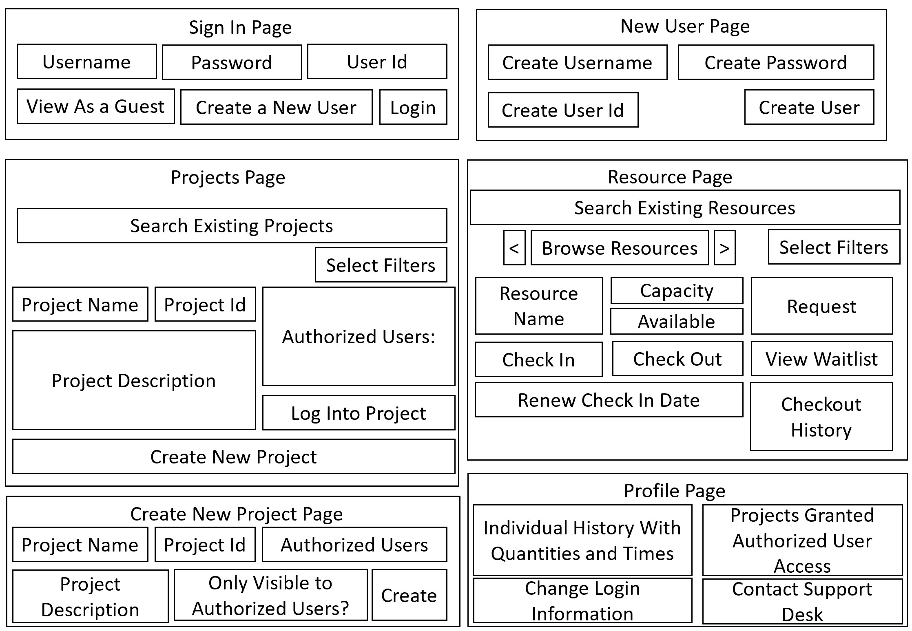

# 461LProject
This is the repository for our 461L team project. 

## Project Plan: 
### R1-1:
The members include Grayson, Brock, Arjun, Tyler and Axel.  
Sprint Velocity: Weekly meetings on Mondays in person at EER.  
Collaboration: Github used for all coding collaboration.  
Communication: Slack is utilized for updates, issues, and other communication.  
#### Implementation Methodology:  
Prepare: research tools to be utilized  
Plan: division of labor -- role assignment, project assessment  
Design: mockups, sketches, rudimentary implementation  
Validate: unit testing, functional testing, integration testing  
Deploy: release/publish finalized project  

### R1-2:
#### Features: 
PoC delivered within budget and schedule constraints, with updates to stakeholders.  
PoC will have front-end web app that allows user input and output.  
PoC app will have an encryption mechanism for user and password security.  
PoC will have mechanism for adding/accessing projects.  
PoC will have a database for storing login details, project codes, and resources information.  
Stable site that can handle 10 concurrent users.  
Ablity to create account and login securely.  
User information tied to login and kept up-to-date on server.  
Search functionality, allowing users to search for specific items.   
Filtering functionality allowing users to sort by category.  

#### Technical Debt:
Technical Debt: Initial baseline implementation will lack certain functionality at the beginning. We recognize that some of these features like filtering, searching,
and categorization will be implemented at a later point which will incur a technical debt. To offset this, we will frontload the researching of these aspects
while saving the implementation for a later date. 
To minimize technical debt, throughout the development process, we will provide adequate comments and perform regular testing.  

#### User Stories:
User-  
As a user I would want a visually appealing UI that is easy to navigate.  
As a user I would want to be able to filter to see items in a specific category.  
As a user I would want to search for items instead of looking through a catalog.  
As a user I would want a responsive site.  
As a user I would want a personal username and password login.  
As a guest user I would want to be able to view waitlists and who has items checked out without signing in.  
As a user I would want to see how long I have checked something out for.  
As a user I would like to be able to see real-time updates of the amount of available hardware.  
As a user I would like to see what I have checked-out and how many.  
As a user I would like to have my login information cached, so I don’t have to login at every site access.  
As a user I would like the site to respond promptly to clicks and page accesses. (no lag)  
As a user I would like to easily check-in information I find crucial.  
As a user I would like to easily check-out information I find crucial.  
As a user I want my experience to be intuitive.  
As a user I would want for my personal information to be safe (privacy).  
As a user I would not like everyone to be able to see all my projects.  
As a user I would like to maybe have the option to re-checkout an item if I still need it longer.  
As a user I would like to maybe have an option of asking a question to a representative through a chat box or email.  

Admin-  
As an admin I would want to search for projects instead of looking through a catalog.  
As an admin I would want to view all projects.  
As a project manager, I would like my own unique project with personal identifiable information.  
As an admin I would want to see every piece of hardware have its own (ID) to make it easier to track.  
As an admin I would want to be able to make minor changes to the site without the site crashing for users.  

CEO-  
As a CEO I would want check-out history to be tracked and easily referenced.  
As a CEO I want login information to be encrypted for protection.  
As a CEO I would like the site to operate well even with high volume site traffic.  
As a CEO I want the site to be reliable.  
As a CEO I expect the site to function without constant supervision.  
As a CEO I want to stick to the US laws on Privacy about info we can collect on users.  

#### Research Items:

### R1-3:

### R1-4:
#### Tools:
Figma for mockups;  
Python for backend;  
PyTest for testing;  
MongoDB for database;  
Heroku for cloud deploying;  
React.js for front-end;  

#### Approach:
We are going to have a front-end and a back-end team that work together and communicate with each other throughout the project. Teams will check up with each other
in our weekly meetings and plan accoridingly as we go.  

Front-end: Tyler, Axel  
Back-end: Brock, Arjun, Grayson  
